# SUKMA BAGUS WAHASDWIKA-2241720223

## Getting Started

This project is a starting point for a Flutter application.

A few resources to get you started if this is your first Flutter project:

- [Lab: Write your first Flutter app](https://docs.flutter.dev/get-started/codelab)
- [Cookbook: Useful Flutter samples](https://docs.flutter.dev/cookbook)

## **wahasdwika_app** 

1. Create a Project:

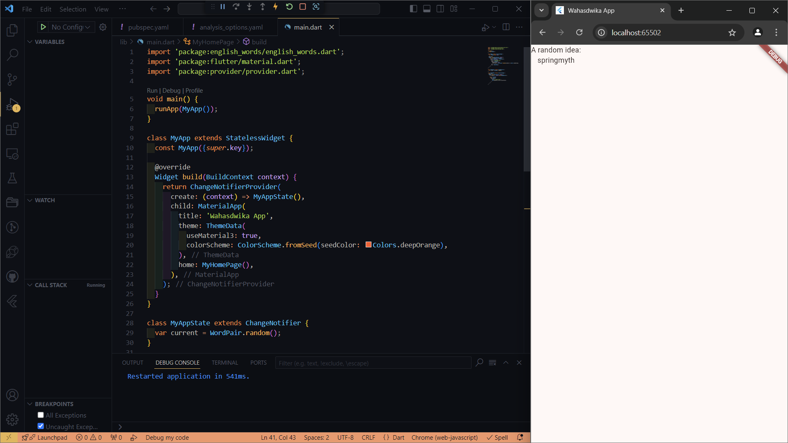

2. Add a button

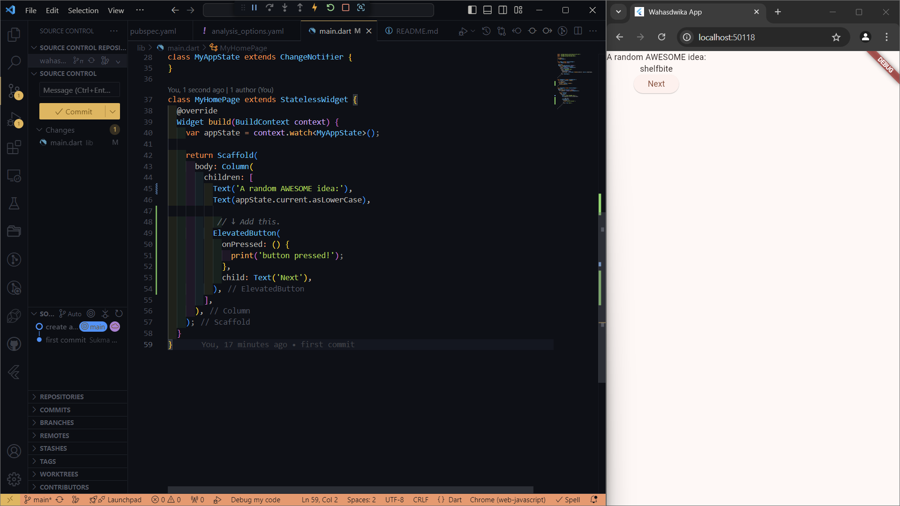

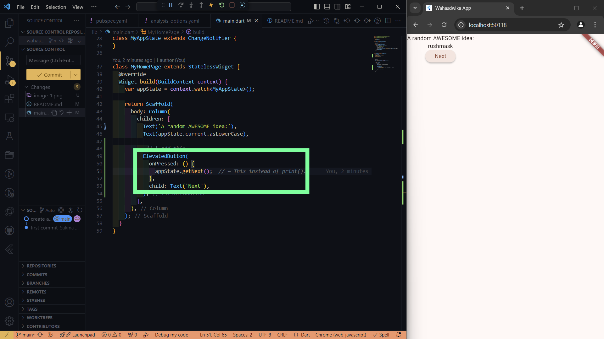

3. Make the app prettier

    This wraps the Padding widget, and therefore also the Text, with a Card widget:

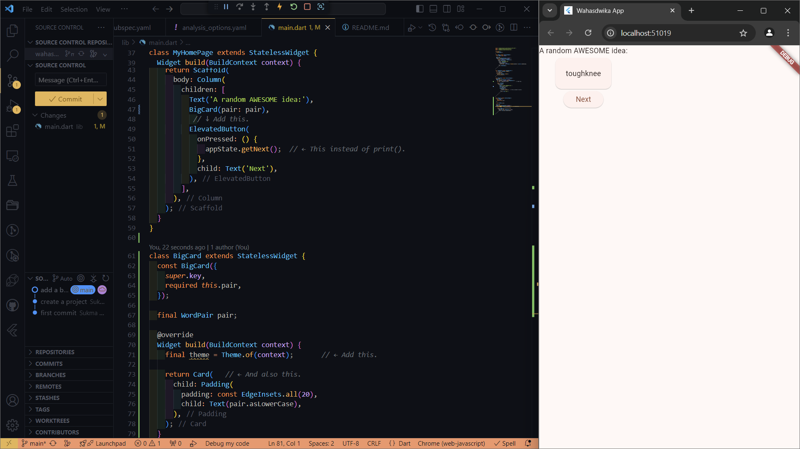

    The card is now painted with the app's primary color:

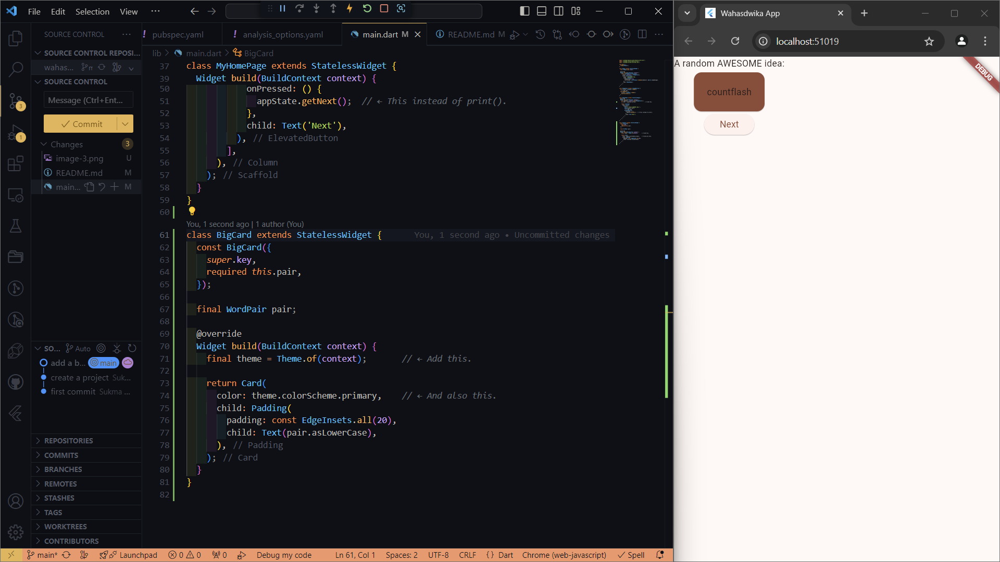

    The app should now look something like the following:

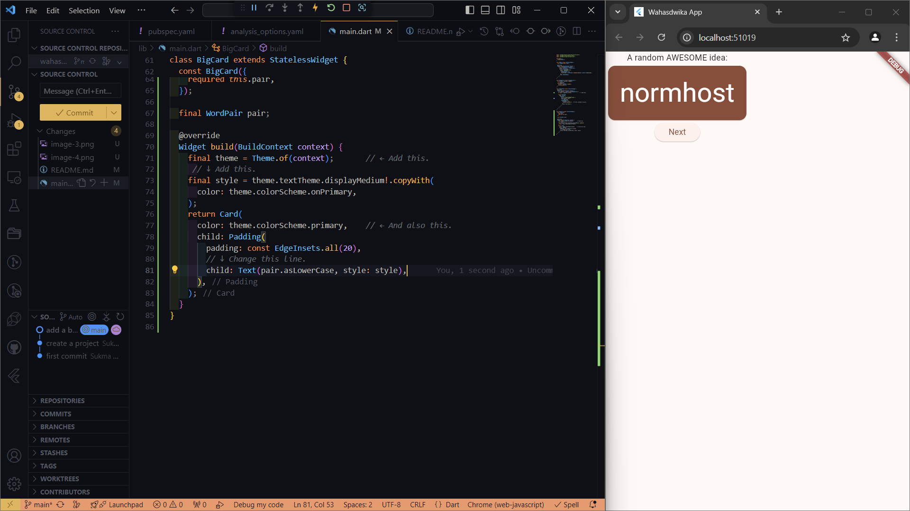

    This centers the children inside the Column along its main (vertical) axis:

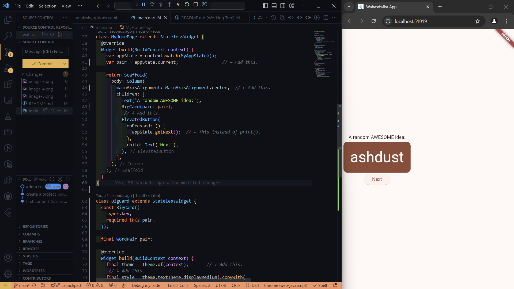

    The app should now look something like the following:

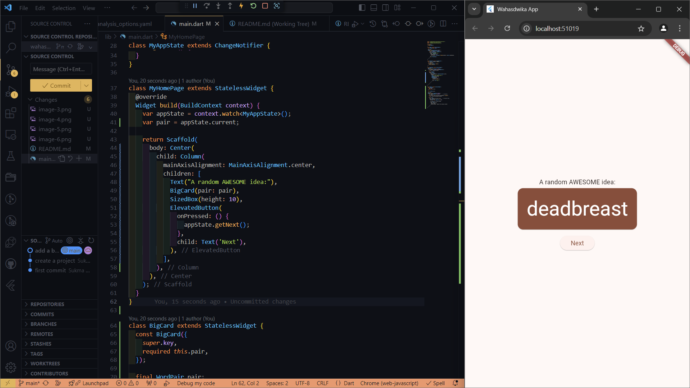

    And the app looks like the following:

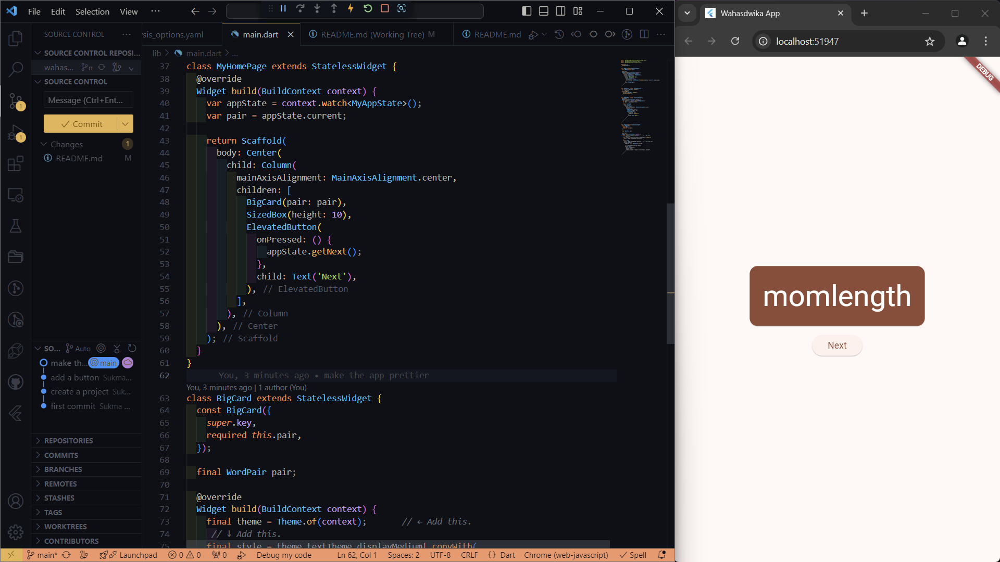

4. Add functionality

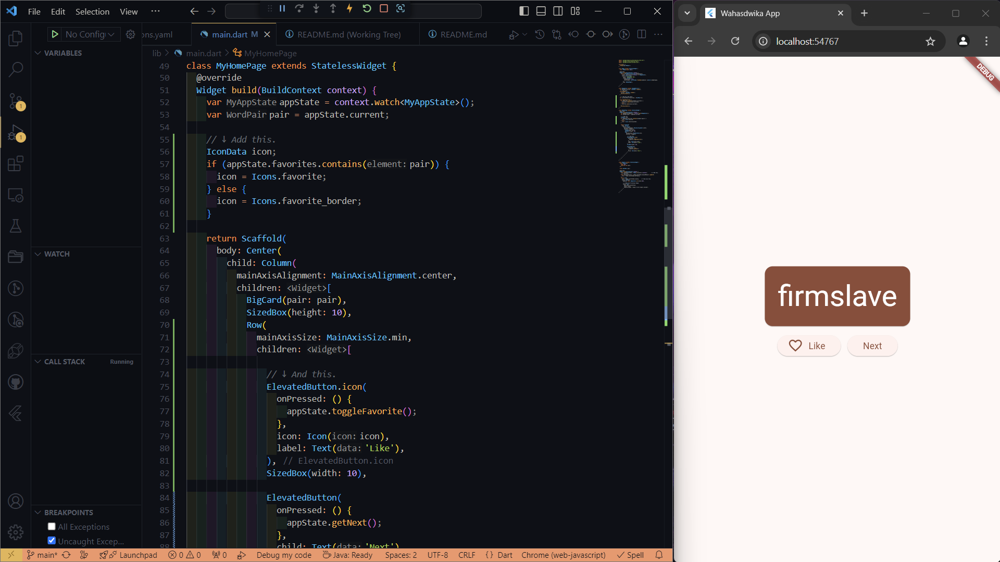

5. Add navigation rail

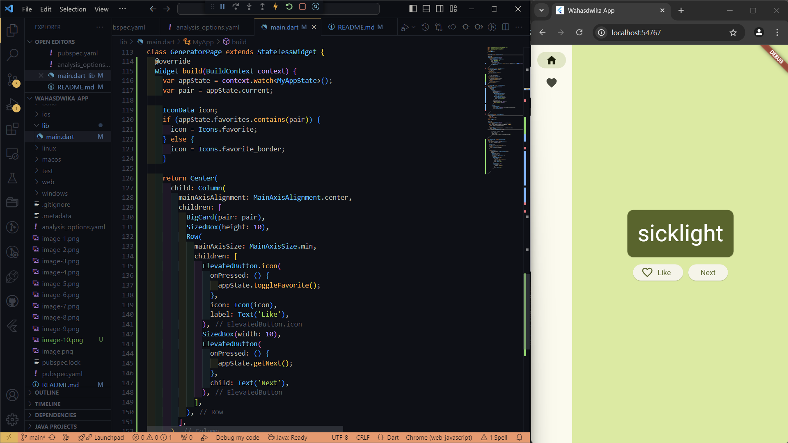

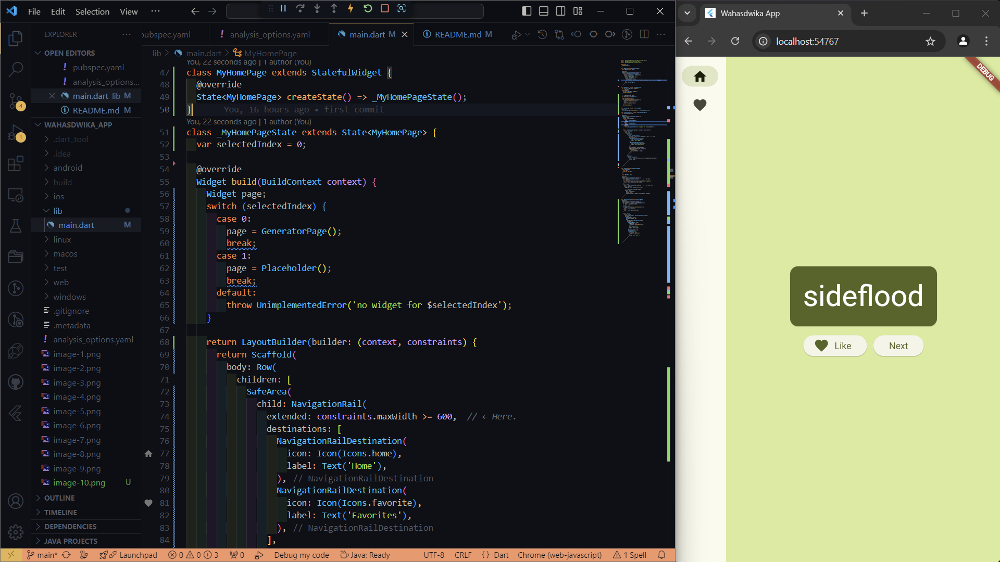

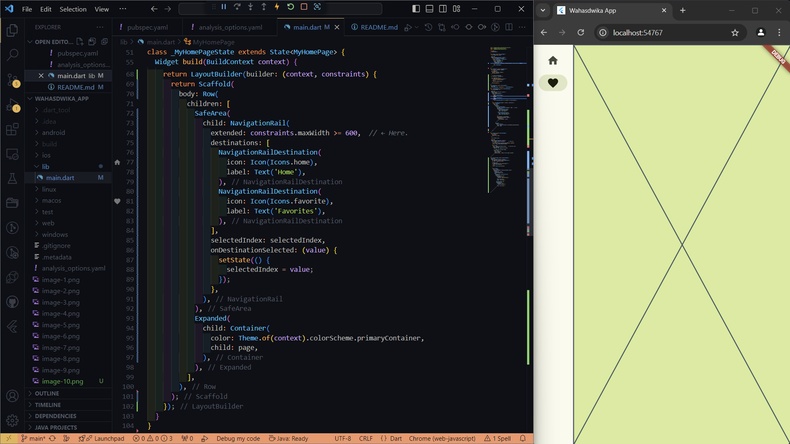

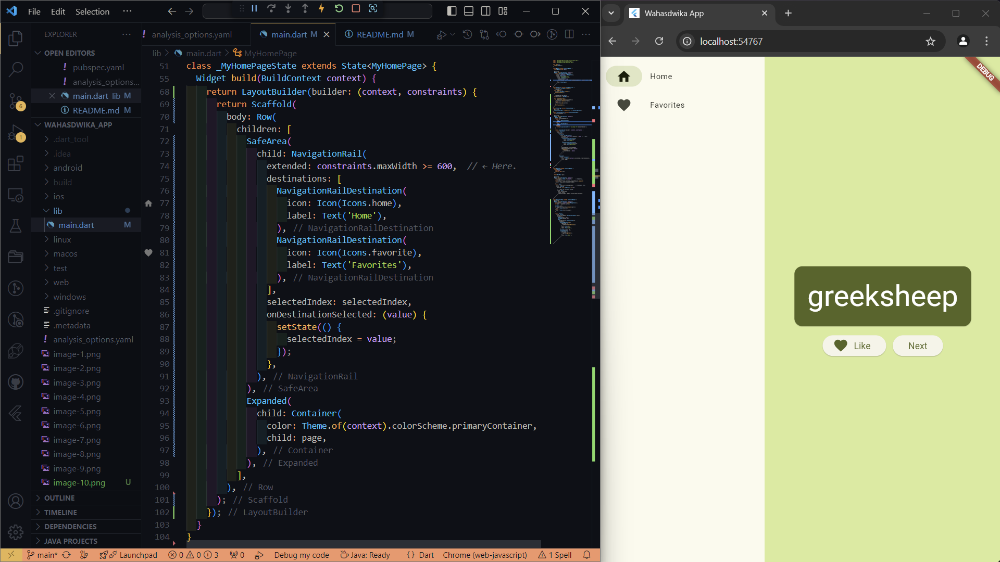

6. Add a new page

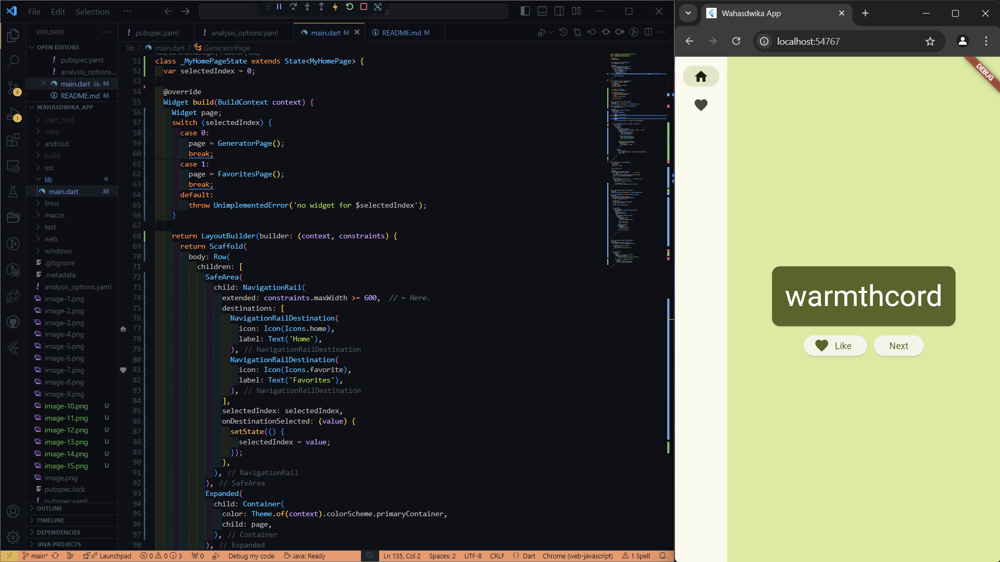

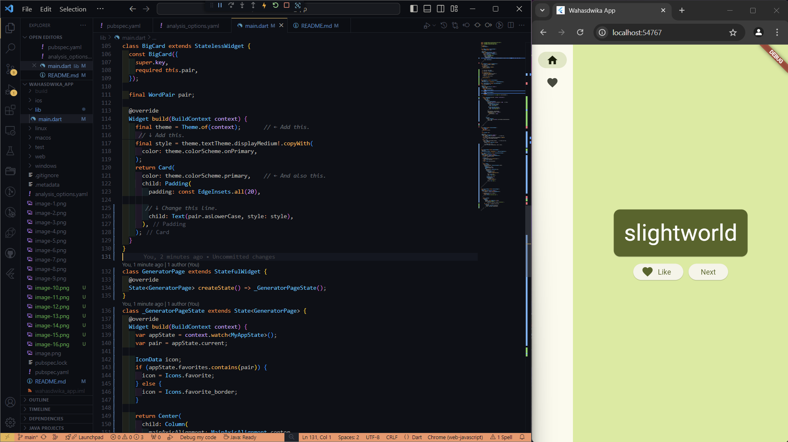

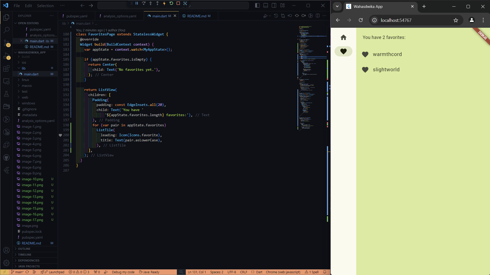